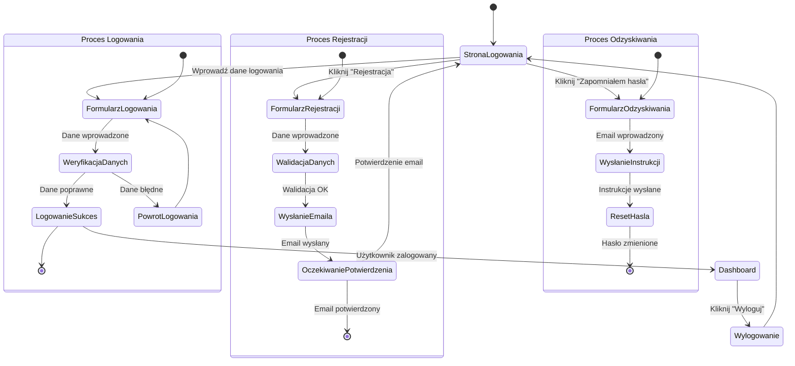

<user_journey_analysis>
W niniejszej analizie przedstawiono podróż użytkownika dla modułu logowania i rejestracji:
1. Użytkownik rozpoczyna na stronie logowania jako niezalogowany.
2. Ze strony logowania użytkownik ma trzy opcje:
   - Wprowadzenie danych logowania (Proces Logowania).
   - Przejście do formularza rejestracji (Proces Rejestracji), gdzie po wprowadzeniu danych następuje walidacja i wysłanie emaila weryfikacyjnego, a następnie aktywacja konta po potwierdzeniu.
   - Skorzystanie z opcji "Zapomniałem hasła" (Proces Odzyskiwania), gdzie użytkownik resetuje hasło.
3. W procesie logowania, po poprawnym wprowadzeniu danych, użytkownik zostaje przekierowany do Dashboardu, a z poziomu Dashboardu może się wylogować, powracając do strony logowania.
</user_journey_analysis>

<mermaid_diagram>

</mermaid_diagram> 